# BIT 4107 – CAT 1 TECHNICAL REPORT
## Mobile Application Development

| Field | Details |
|-------|---------|
| **Student Name** | OLAME BARHIBONERA EBEN-EZER |
| **Admission Number** | BIT/2023/66873 |
| **School/Faculty** | School of Computing and Informatics |
| **Programme** | Bachelor of Information Technology (BIT) |
| **Lecturer** | Nyoro Michael |
| **Assessment** | CAT 1 – Continuous Assessment Test |
| **Project** | HostelHub – University Hostel Finder for Kenyan Students |
| **Date** | June 2026 |

---

## 1. CAT Overview

CAT 1 evaluates a complete mobile application integrating concepts from **Weeks 1–5**:

| Week topic | Integrated in HostelHub |
|------------|----------------------|
| Week 1 – Mobile development introduction | Cross-platform Expo/React Native project |
| Week 2 – Languages & frameworks | TypeScript, React Native, Expo Router |
| Week 3 – User interface design | 13 screens, NativeWind, Figma-based UI |
| Week 4 – Event handling | Search, filters, favourites, navigation |
| Week 5 – Data management | Models, local data, CRUD via services |

---

## 2. Problem Statement

Kenyan university students struggle to find safe, affordable hostels near their campus. **HostelHub** is a mobile application that lets students search, filter, save favourites, and book hostels linked to **50 Kenyan universities**.

---

## 3. Technology Stack

| Layer | Technology |
|-------|------------|
| Framework | React Native + Expo SDK 54 |
| Language | TypeScript |
| Navigation | Expo Router (file-based) |
| Styling | NativeWind v4 (Tailwind CSS) |
| State | React Context API |
| Data | Local TypeScript data files + in-memory services |
| Icons | Lucide React Native |

---

## 4. CAT Required Modules → HostelHub Mapping

| CAT module | HostelHub implementation | File(s) |
|------------|-------------------------|---------|
| 1. Login Screen | Email/password login with validation | `app/(auth)/login.tsx` |
| 2. Dashboard | Home screen with hostels, search, filters | `app/(tabs)/home.tsx` |
| 3. Student Registration | Full register form (name, email, university) | `app/(auth)/register.tsx` |
| 4. Local Database | Universities, hostels, bookings, favourites | `data/`, `services/`, `models/` |
| 5. API Integration | Async service layer + remote images (HTTP GET) | `services/hostelService.ts` |
| 6. Reports Screen | Bookings tab – booking history and status | `app/(tabs)/bookings.tsx` |

---

## 5. Marking Scheme Evidence (30 Marks)

### 5.1 User Interface Design — 5 Marks

**What was built:**
- 13 modern mobile screens with consistent blue theme (`#1A56DB`)
- Custom fonts: Plus Jakarta Sans, DM Sans
- Gradient headers, rounded cards, responsive mobile layout
- Reusable components: `HostelCard`, `LocationPicker`, `HostelLogo`

**Evidence:**

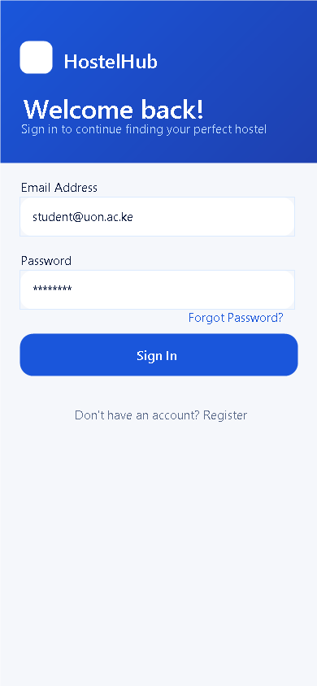
*Figure 5.1 – Login screen*

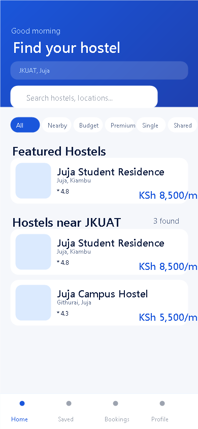
*Figure 5.2 – Dashboard (Home) screen*

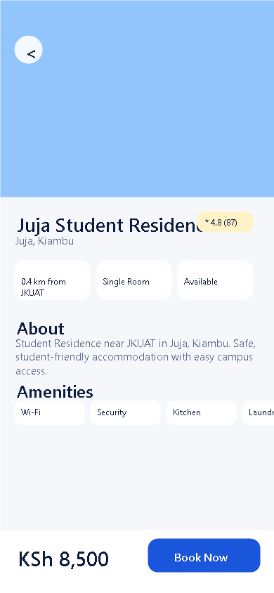
*Figure 5.3 – Hostel details screen*

---

### 5.2 Navigation — 4 Marks

**What was built:**
- Splash → Auth stack → Tab navigator → Detail screens
- Bottom tabs: Home, Saved, Bookings, Profile
- Dynamic routes: `/hostel/[id]`, `/booking/[id]`

**Navigation flow:**
```
index (Splash)
  → (auth)/login | register | forgot-password
  → (tabs)/home | favorites | bookings | profile
  → hostel/[id] → booking/[id]
```

**Evidence:**


*Figure 5.4 – App entry (Splash)*

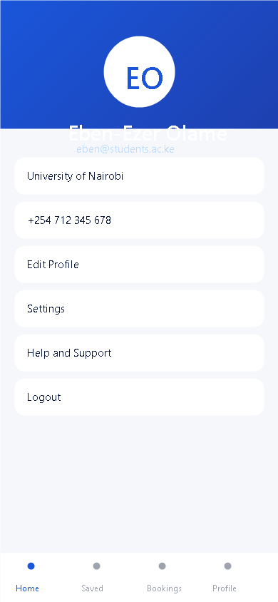
*Figure 5.5 – Tab navigation – Profile*

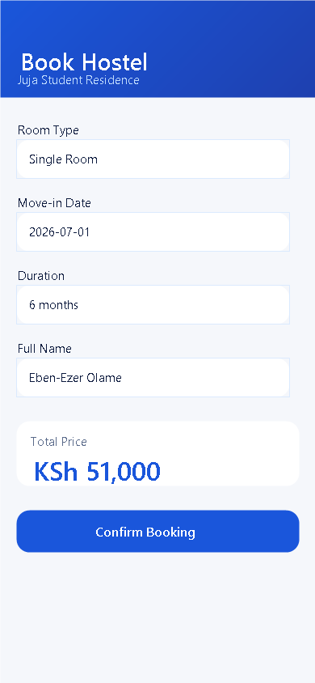
*Figure 5.6 – Stack navigation – Booking screen*

---

### 5.3 Local Storage — 5 Marks

**What was built:**
- **Models:** `User`, `Hostel`, `Booking` (`models/`)
- **Data files:** 50 universities, ~150 hostels (`data/universities.ts`, `data/hostels.ts`)
- **Session storage:** login state, favourites, selected campus (`AppContext`, `hostelService`)
- **CRUD:** create booking, add/remove favourite, register user, search records

| CRUD | Operation | Service method |
|------|-----------|----------------|
| Create | New booking | `bookingService.createBooking()` |
| Create | Add favourite | `hostelService.addToFavorites()` |
| Read | List hostels | `hostelService.getAllHostels()` |
| Read | Search | `hostelService.searchHostels()` |
| Update | Cancel booking | `bookingService.cancelBooking()` |
| Delete | Remove favourite | `hostelService.removeFromFavorites()` |

**Evidence:**

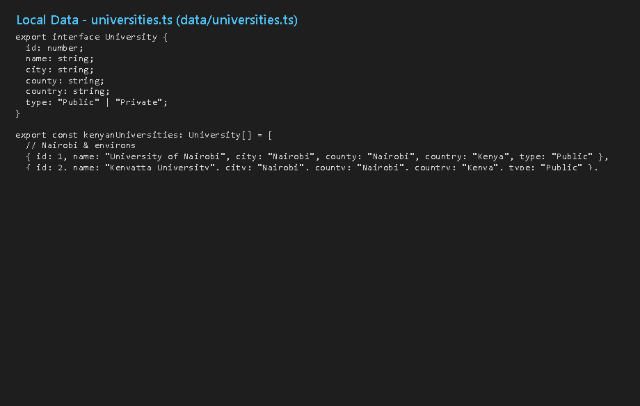
*Figure 5.7 – Local data: 50 Kenyan universities*

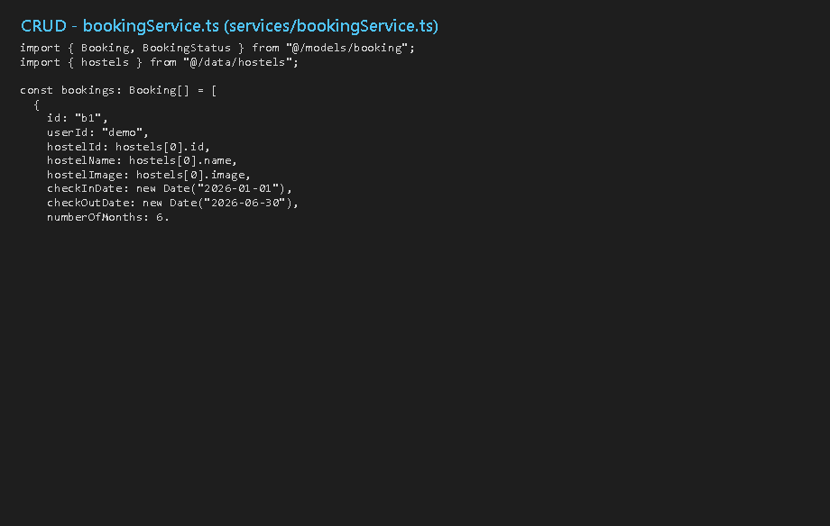
*Figure 5.8 – Booking service CRUD code*

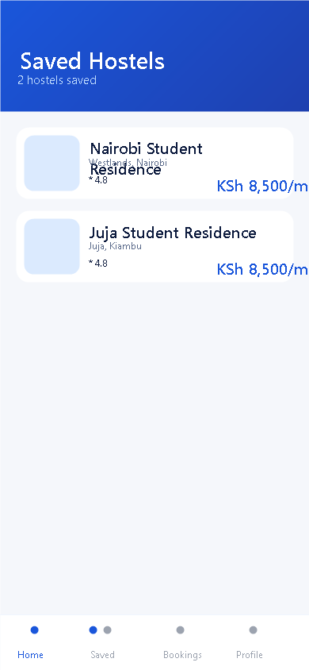
*Figure 5.9 – Saved favourites (local records)*

---

### 5.4 Data Retrieval — 4 Marks

**What was built:**
- Search hostels by name, location, or university
- Filter by category: Budget, Premium, Single, Shared
- Filter by selected university (e.g. JKUAT → 3 hostels)
- Display records in scrollable lists using `HostelCard`
- Bookings tab retrieves user booking history

**Evidence:**


*Figure 5.10 – Data retrieval: hostels near JKUAT*

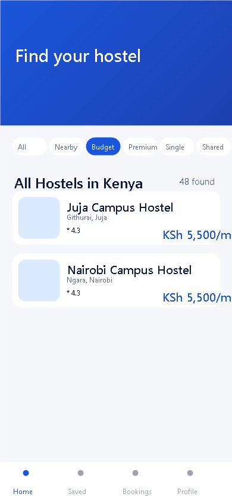
*Figure 5.11 – Data retrieval: Budget filter*

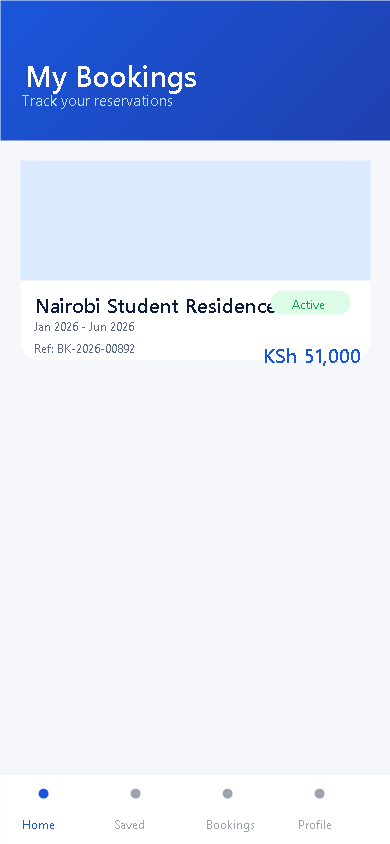
*Figure 5.12 – Reports: booking history*

---

### 5.5 Networking / API — 5 Marks

**What was built:**
- Async service layer with `async/await` and simulated network delay
- HTTP GET for remote hostel images (Unsplash URLs)
- JSON-structured data with TypeScript interfaces
- Loading indicators during async operations
- Planned REST endpoints for Firebase/Supabase backend

**Sample async pattern:**
```typescript
async getAllHostels(): Promise<Hostel[]> {
  await delay(500);
  return hostels;
}
```

**Evidence:**

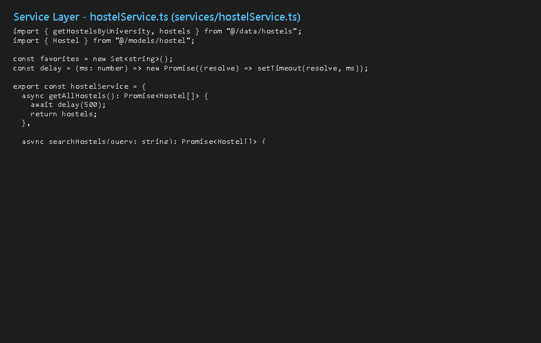
*Figure 5.13 – Async networking service layer*


*Figure 5.14 – Async booking operation*

---

### 5.6 Error Handling — 3 Marks

**What was built:**
- Login validation: email format, password min 6 characters
- `Alert.alert()` on failed login (generic secure message)
- Register validation: password match, phone length
- Null check when hostel not found
- Booking rejected if `numberOfMonths <= 0`

**Evidence:**


*Figure 5.15 – Error handling: login failed alert*

---

### 5.7 Code Quality — 2 Marks

**What was built:**
- TypeScript strict typing across models and services
- Layered architecture: `app/`, `components/`, `contexts/`, `services/`, `models/`, `data/`
- Separation of concerns: UI in screens, logic in services
- `npx tsc --noEmit` — **Pass**

**Evidence:**


*Figure 5.16 – Code quality: TypeScript compile check*

---

### 5.8 Documentation — 2 Marks

**Submitted documents:**
| Document | Location |
|----------|----------|
| Student logbook (Weeks 1–6) | `LOGBOOK.md` |
| CAT 1 technical report | `CAT1-REPORT.md` (this file) |
| Screenshots (18 images) | `screenshots/` folder |
| Source code | `HostelHub/` project folder |

---

## 6. Application Architecture

```
HostelHub/
├── app/                    ← Screens & routing
│   ├── index.tsx           ← Splash
│   ├── (auth)/             ← Login, Register
│   ├── (tabs)/             ← Home, Favorites, Bookings, Profile
│   ├── hostel/[id].tsx     ← Details
│   └── booking/[id].tsx     ← Booking
├── components/             ← HostelCard, LocationPicker
├── contexts/               ← AppContext (global state)
├── services/               ← authService, hostelService, bookingService
├── models/                 ← User, Hostel, Booking interfaces
└── data/                   ← universities.ts, hostels.ts, locations.ts
```

---

## 7. CAT Demonstration Script

Use this script during the live CAT demonstration:

| Step | Action | Expected result |
|------|--------|-----------------|
| 1 | Open app | Splash screen appears |
| 2 | Tap Get Started → Login | Login screen opens |
| 3 | Enter valid email + password (6+ chars) | Navigate to Home dashboard |
| 4 | Tap location bar → select JKUAT | 3 hostels near JKUAT shown |
| 5 | Tap Budget filter | Only budget hostels listed |
| 6 | Type "Juja" in search | Filtered search results |
| 7 | Tap a hostel card | Hostel details screen opens |
| 8 | Tap heart icon | Hostel added to Favourites |
| 9 | Go to Saved tab | Favourited hostel visible |
| 10 | Tap Book Now → Confirm | Booking created |
| 11 | Go to Bookings tab | New booking listed with reference |
| 12 | Logout → wrong password | Error alert shown |

---

## 8. Testing Results

| Test | Result | Evidence |
|------|--------|----------|
| TypeScript compile (`tsc --noEmit`) | ✅ Pass | `screenshots/evidence/tsc-check.png` |
| Login with valid credentials | ✅ Pass | `screenshots/04-home.png` |
| Login with invalid credentials | ✅ Pass | `screenshots/12-login-error.png` |
| Register new user | ✅ Pass | `screenshots/03-register.png` |
| University filter (JKUAT) | ✅ Pass | `screenshots/04-home.png` |
| Budget category filter | ✅ Pass | `screenshots/11-home-budget-filter.png` |
| Favourites add/remove | ✅ Pass | `screenshots/05-favorites.png` |
| Booking creation | ✅ Pass | `screenshots/09-booking.png` |
| Bookings report display | ✅ Pass | `screenshots/06-bookings.png` |
| Navigation all screens | ✅ Pass | All screenshots in `screenshots/` |

---

## 9. CAT Submission Checklist

| # | Requirement | Status | File / Location |
|---|-------------|--------|-----------------|
| 1 | Submit source code | ✅ Ready | `HostelHub/` folder |
| 2 | Submit screenshots | ✅ Ready | `screenshots/` (18 PNG files) |
| 3 | Submit technical report | ✅ Ready | `CAT1-REPORT.md` |
| 4 | Demonstrate application | ✅ Ready | Demo script in Section 7 |
| 5 | Student logbook | ✅ Ready | `LOGBOOK.md` |

---

## 10. How to Run the Application

```bash
cd HostelHub
npm install
npx expo start
```

Scan the QR code with **Expo Go** on Android, or press `a` for Android emulator.

**Test login:** any email with `@` and password with 6+ characters (e.g. `student@uon.ac.ke` / `password123`)

---

## 11. Defence Questions (Prepared Answers)

**Q: What is your app about?**  
A: HostelHub helps Kenyan university students find, compare, favourite, and book hostels near their campus. It covers 50 universities and 150 hostels.

**Q: How is data stored locally?**  
A: Universities and hostels are in TypeScript data files. User session, favourites, and bookings use in-memory services (`authService`, `hostelService`, `bookingService`) and React Context — equivalent to Shared Preferences and SQLite patterns.

**Q: How does API integration work?**  
A: All services use `async/await` with simulated delay. Remote images load via HTTP GET from Unsplash. The structure is ready for a real REST API backend.

**Q: How do you handle errors?**  
A: Form validation on login/register, `Alert.alert()` for auth failures, null checks for missing hostels, and validation before creating bookings.

**Q: Explain your navigation.**  
A: Expo Router with an auth stack, bottom tab navigator for main screens, and dynamic routes for hostel details and booking.

---

## 12. Student Declaration

I declare that this CAT submission represents my own practical work on the HostelHub project. I can demonstrate and explain every feature listed in this report.

**Student Name:** OLAME BARHIBONERA EBEN-EZER  
**Admission Number:** BIT/2023/66873  
**Signature:** _________________________  
**Date:** _________________________  

---

## Appendix: All Screenshots

| File | Description |
|------|-------------|
| `01-splash.png` | Splash / app entry |
| `02-login.png` | Login screen |
| `03-register.png` | Registration screen |
| `04-home.png` | Dashboard / Home |
| `05-favorites.png` | Saved hostels |
| `06-bookings.png` | Reports / Bookings |
| `07-profile.png` | User profile |
| `08-hostel-details.png` | Hostel details |
| `09-booking.png` | Booking form |
| `10-location-picker.png` | University picker |
| `11-home-budget-filter.png` | Budget filter |
| `12-login-error.png` | Error handling |
| `evidence/environment.png` | Dev environment |
| `evidence/tsc-check.png` | TypeScript pass |
| `evidence/git-commits.png` | Git history |
| `evidence/hostel-service.png` | API service code |
| `evidence/data-universities.png` | Local data |
| `evidence/booking-service.png` | CRUD code |
