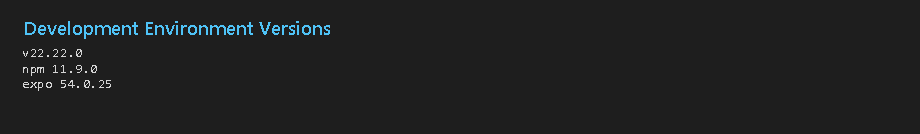
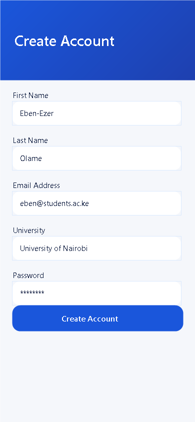
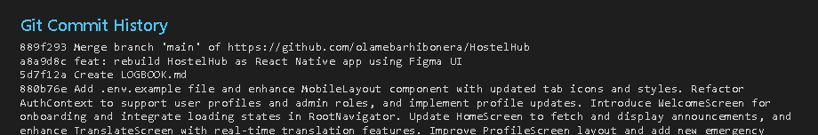
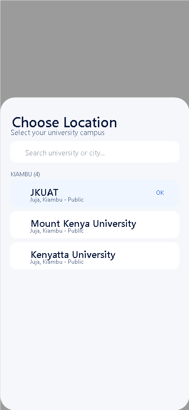

# BIT 4107 – MOBILE APPLICATION DEVELOPMENT
## ENHANCED PROFESSIONAL STUDENT LOGBOOK

**Student Name:** OLAME BARHIBONERA EBEN-EZER  
**Admission Number:** BIT/2023/66873  
**School/Faculty:** School of Computing and Informatics  
**Programme:** Bachelor of Information Technology (BIT)  
**Academic Year:** 2025/2026  
**Semester:** Eighth Semester  
**Lecturer:** Nyoro Michael  
**Phone Number:** 0110411706  

---

## Instructions

This logbook is used to document weekly learning activities, practical exercises, skills acquired, challenges encountered, solutions applied, and reflections. Students should complete all sections every week.

**Each week follows the remarks in the Week 1 section:**
1. Practical Activities Undertaken  
2. Screenshots/Evidence Attached (Yes/No) with labeling  
3. Tools/Software Used  
4. Personal Reflection (not more than 50 words)

Attach actual screenshots when submitting the Word document. Keep the `screenshots/` folder beside the document.

---

## Table of Contents

1. Week 1: Introduction to Mobile Application Development  
2. Week 2: Mobile Development Environment  
3. Week 3: User Interface Design  
4. Week 4: Event Handling and User Interaction  
5. Week 5: Data Management  
6. Final Approval  

---

## Week 1: Introduction to Mobile Application Development

### Practical Activities Undertaken

- Studied the mobile application ecosystem: Android, iOS, and cross-platform development.
- Compared native development (Kotlin, Swift) with cross-platform tools (Flutter, React Native).
- Installed development tools: Android Studio, VS Code/Cursor, Git, Java JDK, Node.js, Python, and Flutter SDK.
- Configured Android SDK, created a virtual device, and ran the Android emulator.
- Completed Assignment 1: Flutter Hello World app with custom title, background colour, and font size.
- Identified the semester project problem: Kenyan students need help finding hostels near campus.
- Started the **HostelHub** project — a mobile app to search, compare, favourite, and book hostels.

### Screenshots/Evidence Attached

**Yes**

| # | Label |
|---|-------|
| 1 | Development environment – Node.js, npm, Expo versions |
| 2 | HostelHub splash screen (first mobile app) |




### Tools/Software Used

Android Studio, VS Code/Cursor, Flutter SDK, Git, Java JDK, Node.js, Python 3.x, Android Emulator, Figma, Expo documentation

### Personal Reflection

Week 1 introduced mobile platforms and development tools. Installing Android Studio, Flutter, and Node.js was challenging but necessary. Defining the HostelHub problem gave my semester project clear purpose and direction.

---

## Week 2: Mobile Development Environment

### Practical Activities Undertaken

- Practised JavaScript/TypeScript syntax: variables, functions, loops, classes, and async/await.
- Created the HostelHub Expo project with SDK 54, TypeScript, and Expo Router.
- Built UI components: buttons, text fields, images, and bottom tab navigation.
- Implemented Login, Register, and Home (dashboard) screens.
- Created service files: `authService`, `hostelService`, and `bookingService`.
- Set up `AppContext` for user session, favourites, and campus location.
- Completed Week 2 assignment: login page, registration, local data storage, and navigation.

### Screenshots/Evidence Attached

**Yes**

| # | Label |
|---|-------|
| 1 | Login screen with email and password fields |
| 2 | Register screen with student details |
| 3 | Home dashboard after login |
| 4 | Git commit history |







### Tools/Software Used

React Native, Expo SDK 54, TypeScript, Expo Router, React Context API, npm, Git/GitHub, Lucide React Native

### Personal Reflection

Week 2 improved my framework skills. Building login, registration, and navigation showed how TypeScript, React state, and services connect. Fixing Expo SDK and npm errors strengthened my debugging ability.

---

## Week 3: User Interface Design

### Practical Activities Undertaken

- Designed wireframes and GUI mockups for HostelHub in Figma.
- Applied colour scheme (`#1A56DB`), typography (DM Sans, Plus Jakarta Sans), and mobile spacing.
- Converted Figma designs into React Native screens using NativeWind v4.
- Built 13 screens: Splash, Login, Register, Forgot Password, Home, Favourites, Bookings, Profile, Hostel Details, Booking, and Location Picker.
- Implemented form validation, search filters, category chips, and favourite toggle.
- Tested the UI on Android emulator and physical device via Expo Go.
- Completed Week 3 assignment: 5+ screens, working navigation, responsive design, and functional forms.

### Screenshots/Evidence Attached

**Yes**

| # | Label |
|---|-------|
| 1 | Splash screen |
| 2 | Login and Register screens |
| 3 | Home screen with search and category filters |
| 4 | Location picker – Kenyan universities by county |
| 5 | Hostel details screen with amenities |
| 6 | Booking screen |
| 7 | Favourites, Bookings, and Profile tabs |





### Tools/Software Used

Figma, React Native, Expo SDK 54, NativeWind v4, Tailwind CSS, Expo Linear Gradient, Lucide React Native, Expo Go

### Personal Reflection

Week 3 was highly creative. Turning Figma designs into thirteen working screens was rewarding. Search, filters, and device testing made HostelHub feel like a real student accommodation app.

---

## Week 4: Event Handling and User Interaction

### Practical Activities Undertaken

- Implemented `Pressable` handlers for navigation, favourites, and category filter chips.
- Built real-time search filtering by hostel name, location, and university.
- Created the location picker modal with university search grouped by county.
- Wired navigation flow: Splash → Auth → Tabs → Hostel Details → Booking.
- Synced favourite toggle across Home, Details, and Favourites screens using `AppContext`.
- Added `Alert` dialogs for login errors and user feedback on actions.

### Screenshots/Evidence Attached

**Yes**

| # | Label |
|---|-------|
| 1 | Budget category filter active on Home screen |
| 2 | Location picker modal open |
| 3 | Login failed alert dialog |
| 4 | Favourites screen after heart toggle |


### Tools/Software Used

React useState, useMemo, Pressable, TextInput, Expo Router, React Native Alert, Modal

### Personal Reflection

Week 4 taught event-driven programming. Every tap, search, and filter required careful state management. Connecting user actions to data updates across screens was a key practical skill.

---

## Week 5: Data Management

### Practical Activities Undertaken

- Studied data management: temporary storage (variables) vs permanent storage (Shared Preferences / SQLite concepts).
- Designed data models: `User`, `Hostel`, and `Booking` in `models/`.
- Built local data: 50 Kenyan universities and ~150 linked hostels in `data/`.
- Implemented CRUD via services — Create (booking, favourite), Read (search, list), Update (profile, cancel), Delete (remove favourite).
- Stored session data in `AppContext`: login status, campus location, favourite IDs.
- Displayed records using `ScrollView` and `HostelCard` (RecyclerView equivalent).
- Completed assignment: Record Management App with add, update, delete, and search.

### Screenshots/Evidence Attached

**Yes**

| # | Label |
|---|-------|
| 1 | Universities data file – 50 Kenyan universities |
| 2 | Booking service – CRUD operations |
| 3 | Home screen listing hostel records |
| 4 | Favourites – saved hostel records |
| 5 | Bookings – stored booking records |


### Tools/Software Used

TypeScript, React Context API, service-layer pattern, in-memory data stores, SQLite and Shared Preferences concepts

### Personal Reflection

Week 5 showed that good data structure drives every feature. Organising universities, hostels, and bookings into models and services made CRUD and search straightforward to build and test.

---

## Final Approval

**Student Name:** OLAME BARHIBONERA EBEN-EZER  
**Student Signature:** _________________________  
**Date:** _________________________  

**Lecturer Name:** Nyoro Michael  
**Lecturer Remarks:** _________________________  
**Date:** _________________________  

---

## Appendix: Screenshot Files (Weeks 1–5)

```
screenshots/
├── 01-splash.png
├── 02-login.png
├── 03-register.png
├── 04-home.png
├── 05-favorites.png
├── 06-bookings.png
├── 07-profile.png
├── 08-hostel-details.png
├── 09-booking.png
├── 10-location-picker.png
├── 11-home-budget-filter.png
├── 12-login-error.png
└── evidence/
    ├── environment.png
    ├── git-commits.png
    ├── data-universities.png
    └── booking-service.png
```

Regenerate screenshots: `npm run screenshots`
